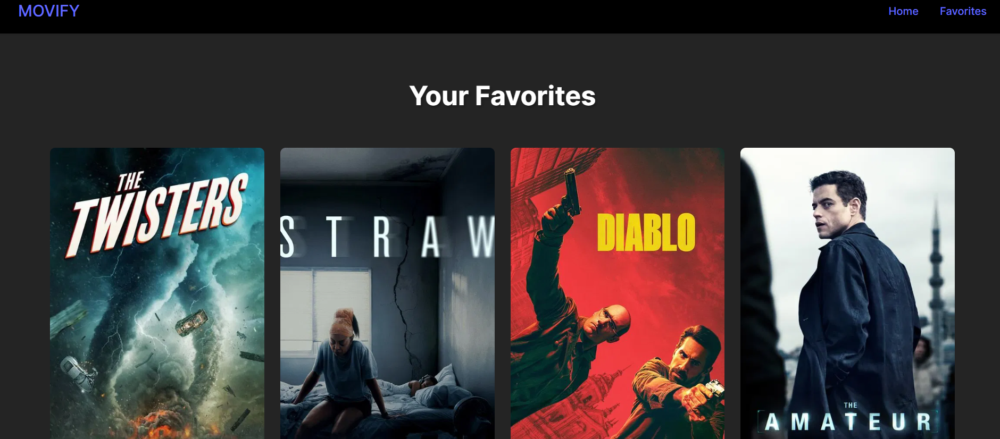

🎬 Movify
A sleek React-based Movie Browser where users can view popular movies and mark their favorites — with a heart ❤️ 

Features-

.Browse popular movies fetched from The Movie Database (TMDB) API

.Add or remove favorites by clicking the heart icon

.Favorite movies are highlighted with a red heart

.Responsive and minimal design with CSS

How It Works-

.The app uses React Context API to manage the list of favorite movie IDs

.Users click the heart icon to add or remove a movie from favorites

.Favorite movies display a red heart icon

Tech Stack-

.React

.CSS

.Context API

.TMDB API

PREVIEW-

### 🏠 Home Page

### 💖 Favorites Page

